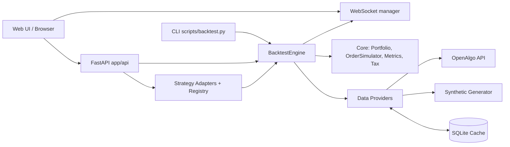
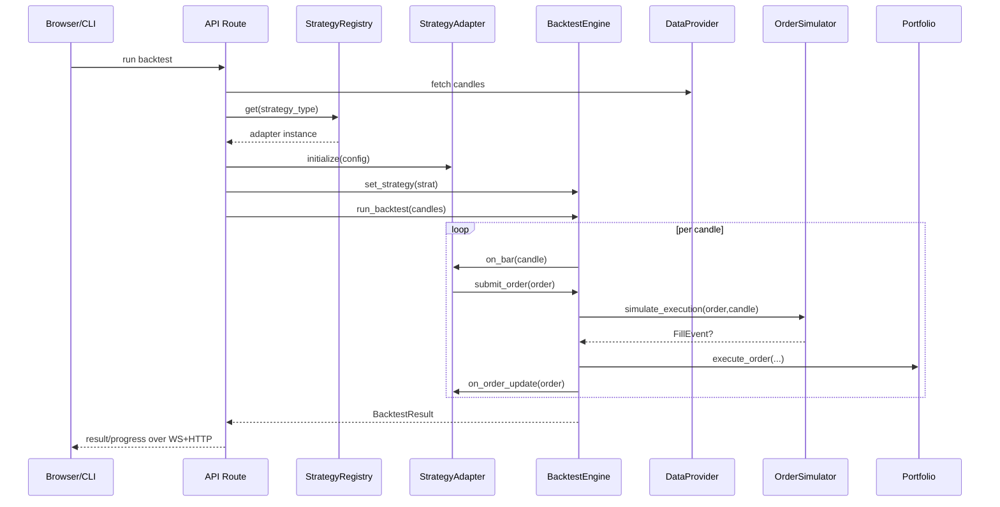

# Project Architecture Blueprint

Generated on: 2026-02-12
Scope: Full repository analysis (`app/`, `strats/`, `scripts/`, `tests/`, `configs/`)

---

## 1) Architecture Detection and Analysis

### 1.1 Technology stack (detected from code and dependencies)

- Language: Python (project guidance targets Python 3.10+; observed runtime 3.11 in local logs)
- API/Web:
  - FastAPI + Uvicorn (`app/api/main.py`, `scripts/launch_web.py`)
  - Jinja2 templates (`app/ui/templates/index.html`)
  - WebSockets for progress streaming (`app/api/websockets.py`, `app/api/routes/backtest.py`)
- CLI:
  - Click-based CLI (`scripts/backtest.py`)
- Data/analytics:
  - pandas, numpy, tqdm
- Config/modeling:
  - Pydantic v2 models (`app/models/*`, `model_dump()` usage)
  - YAML config loading + env-var substitution (`app/utils/config_loader.py`)
- Market integration:
  - OpenAlgo API wrapper (`app/data/openalgo_provider.py`)
- Persistence/caching:
  - SQLite cache for candles (`app/data/cache_manager.py`)
- Testing:
  - pytest + ad-hoc executable test scripts in `tests/`

### 1.2 Architectural pattern (detected)

The implementation is a **hybrid Layered + Adapter + Event-Driven architecture**:

- Layered boundaries are explicit by folder layout (`api`, `core`, `data`, `models`, `strategies`, `utils`).
- Event-driven simulation exists in `BacktestEngine` and `EventQueue` (`app/core/events.py`).
- Adapter pattern bridges external/live strategy bots into the simulation runtime:
  - `BaseStrategy` contract for engine integration
  - `GridStrategyAdapter`, `SupertrendStrategyAdapter`, `UniversalStrategyAdapter`
  - `MockOpenAlgoClient` as anti-corruption shim between bot API calls and engine order submission
- Registry pattern handles strategy discovery and runtime strategy creation (`app/strategies/registry.py`).

---

## 2) Architectural Overview

### 2.1 Core architectural approach

The system separates responsibilities into:

1. **Ingress layer** (HTTP/WebSocket/CLI): receives run/config commands and returns status/results.
2. **Orchestration and simulation core**: `BacktestEngine` drives candle-by-candle execution.
3. **Strategy abstraction layer**: standardized strategy callback contract + adapters.
4. **Data provider layer**: OpenAlgo historical data or synthetic fallback.
5. **Domain models layer**: typed market/order/config/result models.
6. **Cross-cutting utilities**: config loading, logging, time utilities.

### 2.2 Guiding principles evident in code

- Keep strategy logic decoupled from execution mechanics via `BaseStrategy`.
- Preserve realism in simulation via order simulator, slippage, partial fills, and portfolio constraints.
- Allow live-bot code reuse inside backtests via adapters and mock client.
- Prefer typed DTO-style models for API and core boundaries.

### 2.3 Boundaries and enforcement

- API layer does not directly manipulate order fill internals; it delegates to engine and strategy setup.
- Strategy classes submit orders through engine context, not directly to portfolio.
- Data providers return normalized `Candle` model objects.

---

## 3) Architecture Visualization

### 3.1 High-level subsystem view (C4-style container)



### 3.2 Component interaction (runtime)



### 3.3 Data flow

```mermaid
flowchart TD
    CFG[configs/active/*.yaml] --> CL[config_loader]
    CL --> AC[AppConfig]
    AC --> DP[OpenAlgoDataProvider / SyntheticDataProvider]
    DP --> CND[Candle[]]
    CND --> BE[BacktestEngine]
    BE --> ORD[Order lifecycle]
    ORD --> PF[Portfolio state + equity curve]
    PF --> MT[MetricsCalculator + TaxCalculator]
    MT --> RES[BacktestResult]
    RES --> APIRES[In-memory results_storage + HTTP/CSV export]
```

---

## 4) Core Architectural Components

### 4.1 `app/api` (entry and transport)

**Purpose**
- Serve UI, expose run/config/results endpoints, and stream run updates.

**Internal structure**
- `main.py` builds FastAPI app and mounts templates.
- `routes/backtest.py` handles run/cancel/config/results endpoints.
- `websockets.py` maintains active socket clients and broadcasts updates.

**Interaction patterns**
- Uses background task for backtest execution.
- Uses in-memory dictionaries for result storage and running engine registry.

**Evolution points**
- Replace in-memory storage with persistent backend without changing route contracts.
- Add auth middleware around API routes.

### 4.2 `app/core` (simulation engine)

**Purpose**
- Deterministic backtest orchestration and accounting.

**Key modules**
- `backtest_engine.py`: orchestrates candle loop, strategy callbacks, order processing.
- `order_simulator.py`: execution/partial-fill/slippage logic.
- `portfolio.py`: cash/position/equity bookkeeping.
- `metrics.py`: performance metrics.
- `tax_calculator.py`: delivery vs intraday tax handling.
- `events.py`: internal event classes + queue.

**Interaction patterns**
- Engine owns runtime state (`active_orders`, tick counters, run status).
- Strategy only interacts via context methods (`submit_order`, cancellations, read orders).

**Evolution points**
- Add new execution models by extending `OrderSimulator`.
- Add metrics in `MetricsCalculator` without changing API contracts.

### 4.3 `app/strategies` + `strats/` (strategy domain)

**Purpose**
- Reuse live trading bots in backtest environment.

**Key patterns**
- Strategy interface contract: `BaseStrategy`.
- Adapter abstraction:
  - universal adapter for simple bots
  - custom adapter for complex indicator-driven bots
- Registry (`StrategyRegistry`) for runtime strategy lookup.
- Mock bridge (`MockOpenAlgoClient`) to intercept bot API calls and route to engine.

**Evolution points**
- Register new `TradingBot` class with universal adapter for zero-boilerplate entry.
- Use custom adapter only when needed (multi-timeframe, heavy indicator state, special lifecycle).

### 4.4 `app/data` (market data)

**Purpose**
- Unified `Candle[]` provider abstraction.

**Implementations**
- OpenAlgo provider with caching and rate limiting.
- Synthetic generator for offline/fallback test scenarios.
- SQLite cache manager with request-key freshness tracking.

**Evolution points**
- Add provider classes that return same `Candle` shape.

### 4.5 `app/models` (shared schema)

Pydantic models define boundaries for:
- `AppConfig` and nested config sections
- `Candle`, `Quote`
- `Order` and enums
- `Trade`, `PerformanceMetrics`, `BacktestResult`

---

## 5) Architectural Layers and Dependencies

### 5.1 Layer map

1. **Presentation/Transport**: `app/api`, templates, scripts entrypoints
2. **Application/Orchestration**: `app/core/backtest_engine.py`
3. **Domain Logic**: `app/core/*`, strategy adapters, `strats/*`
4. **Infrastructure**: `app/data/*`, SQLite cache, OpenAlgo client
5. **Contracts/Models**: `app/models/*`

### 5.2 Dependency rules observed

- API imports core, strategy registry, data providers, config loader.
- Core imports models and strategy interface, not API layer.
- Strategies depend on models + core context callbacks; adapters depend on `strats` bots.
- Data layer depends on models + external OpenAlgo package + SQLite.

### 5.3 Noted layer violations / caveats

- `BacktestEngine` includes both orchestration and some domain/reporting concerns (trade completion/tax processing), making it a large class.
- `EventQueue` exists but some order-event dispatching is currently commented/minimal.

---

## 6) Data Architecture

### 6.1 Domain entities

- Market: `Candle`, `Quote`
- Execution: `Order` (+ status/action/type enums), fill metadata
- Portfolio: in-memory `Position` dataclass inside `portfolio.py`
- Analytics: `Trade`, `EquityPoint`, `PerformanceMetrics`
- Configuration: typed nested config models in `config.py`

### 6.2 Relationships

- A run has many candles, many orders, many trades, many equity points.
- Portfolio aggregates positions by symbol and cash.
- Result object aggregates config + lifecycle metrics + artifacts.

### 6.3 Data access and transformation

- OpenAlgo DataFrame rows -> `Candle` list.
- `BacktestResult.to_dict()` normalizes nested objects for API serialization.
- CSV export maps trade dictionaries through selected columns.

### 6.4 Caching

- Request-level freshness tracking in `requests` table.
- Candle-level dedupe by `(symbol, exchange, timeframe, timestamp)` primary key.

---

## 7) Cross-Cutting Concerns

### 7.1 Authentication & authorization

- No first-class auth/authorization layer found in FastAPI routes.
- OpenAlgo authentication uses API key in config and OpenAlgo client initialization.

### 7.2 Error handling & resilience

- API routes catch exceptions and return structured JSON errors.
- Data provider returns empty data on failures and logs errors.
- WebSocket broadcaster isolates per-client send failures.
- Backtest task wraps full run in try/except/finally and cleans running-engine registry.

### 7.3 Logging & observability

- Central setup in `app/utils/logging_config.py`.
- Module-level loggers across subsystems.
- Progress events emitted over WebSocket.

### 7.4 Validation

- Pydantic validation for config, order, and model fields.
- Custom validators for timeframe, strategy type, grid type, buffer settings.

### 7.5 Configuration management

- YAML + env substitution (`${VAR}` / `${VAR:default}`).
- Strategy catalog loaded from `configs/active/strats.yaml` with fallback default catalog.

---

## 8) Service Communication Patterns

### 8.1 Protocols and formats

- HTTP JSON for commands and state retrieval.
- WebSocket JSON for status/progress/result streaming.
- CSV stream for trade export.

### 8.2 Sync vs async

- API endpoints are async.
- Backtest run itself is synchronous CPU-bound work, delegated from async route via executor in `run_backtest_task`.

### 8.3 Versioning and discovery

- No explicit API versioning namespace (`/v1`) observed.
- Strategy discovery via `load_strategy_catalog()` + `StrategyRegistry`.

---

## 9) Python-Specific Architectural Patterns

- Package layout reflects domain boundaries (`app/*` + `strats/*`).
- Heavy use of `typing`, dataclasses, and pydantic models for boundary safety.
- Adapter and registry patterns implemented with class methods and factories.
- Mix of OO domain objects (portfolio, engine, bots) and functional utility modules.

---

## 10) Implementation Patterns

### 10.1 Interface design

- `TradingBot` (in `strats/trading_bot.py`) defines required live/backtest bot behaviors.
- `BaseStrategy` defines engine-facing adapter contract.
- Adapters bridge these two interfaces.

### 10.2 Service implementation

- `BacktestEngine` composes collaborators (`Portfolio`, `OrderSimulator`, `MetricsCalculator`, `TaxCalculator`).
- `set_strategy()` injects strategy dependency and context.

### 10.3 Data/repository pattern

- `CacheManager` behaves as repository for candles keyed by request and symbol/timeframe range.

### 10.4 API implementation

- Thin route handlers with orchestration and validation.
- Background task for long-running run.
- in-memory state dictionaries for ephemeral run data.

### 10.5 Domain model implementation

- Pydantic `BaseModel` for transport and persistence serialization.
- `to_dict()` methods normalize datetime and enum serialization explicitly.

---

## 11) Testing Architecture

### 11.1 Strategy

- Primary framework: pytest.
- Mix of pytest-style assertions and executable script-style tests under `tests/`.

### 11.2 Test boundaries

- Unit-ish validation around catalog/config loading.
- Simulation behavior tests for order execution timing and market order validation.
- Integration-ish tests for OpenAlgo provider setup and data consistency.

### 11.3 Test doubles

- Mocking strategy integration uses `MockOpenAlgoClient` within adapter pathway.

### 11.4 Test execution

- `run_tests.py` executes pytest with `PYTHONPATH` configured.
- Make/AGENTS guidance supports focused test runs.

---

## 12) Deployment Architecture

### 12.1 Runtime topology

- Single-process Python app.
- Uvicorn serves FastAPI app (`scripts/launch_web.py`).
- Config drives host/port/logging.

### 12.2 Environment-specific behavior

- Runtime configuration from YAML with env substitutions.
- OpenAlgo usage toggled by presence of API key and `use_synthetic` flag.

### 12.3 Container/orchestration

- No Dockerfile or orchestration manifests detected.

---

## 13) Extension and Evolution Patterns

### 13.1 Feature addition patterns

**Add a new strategy (preferred path)**
1. Implement a new bot class inheriting `TradingBot` in `strats/`.
2. Register it with `StrategyRegistry.register("name", BotClass)`.
3. Add strategy entry to `configs/active/strats.yaml`.
4. Add config schema fields if needed (`StrategyConfig`).

**When to use custom adapter**
- Indicator pre-buffering with heavy DataFrame transforms
- Multi-stage signal state machines
- Non-standard order synchronization

### 13.2 Safe modification patterns

- Keep `BaseStrategy` interface stable.
- Add optional config fields with defaults in pydantic models.
- Preserve response shape in `/api/results/{run_id}`.

### 13.3 External integration pattern

- Wrap external APIs in provider classes and normalize to domain models.
- Keep anti-corruption logic at infrastructure boundary (`app/data/*` or mock adapter bridge).

---

## 14) Architectural Pattern Examples (from code)

### 14.1 Layer separation via strategy context

- Engine injects context: `strategy.set_context(self)`
- Strategy submits orders through context: `self.context.submit_order(order)`

### 14.2 Adapter bridge

- `MockOpenAlgoClient.place_order()` translates bot order params into engine `Order` model and calls `adapter.submit_order(order)`.

### 14.3 Provider fallback

- In route and CLI flow:
  - If synthetic flag or missing API key -> `SyntheticDataProvider`
  - Else -> `OpenAlgoDataProvider`

---

## 15) Architectural Decision Records (inferred)

### ADR-001: Reuse live strategy bots in backtests via adapters

- Context: Existing bot logic in `strats/` should run in simulation.
- Decision: Introduce adapter layer + mock OpenAlgo client.
- Consequences:
  - Positive: High code reuse between live and backtest logic.
  - Negative: Adapter complexity and translation overhead.

### ADR-002: Keep run results in-memory for API sessions

- Context: Need immediate result retrieval and websocket broadcast.
- Decision: Use process-local `results_storage` and `running_engines` dictionaries.
- Consequences:
  - Positive: Simple and fast for single-node operation.
  - Negative: Not durable across process restarts.

### ADR-003: Introduce universal adapter + hooks for strategy onboarding

- Context: Custom adapter boilerplate increased maintenance.
- Decision: Add `UniversalStrategyAdapter` with introspection and lifecycle hooks.
- Consequences:
  - Positive: Faster onboarding for simple strategies.
  - Negative: Complex strategies still need custom adapters.

### ADR-004: Add SQLite candle cache

- Context: Historical data requests are repetitive and expensive.
- Decision: Cache candles and request metadata in SQLite.
- Consequences:
  - Positive: Better speed and reduced API load.
  - Negative: Requires cache freshness management.

---

## 16) Architecture Governance

### 16.1 Current governance mechanisms

- Structural conventions via folder boundaries.
- Typed models and validators enforce config/data contracts.
- Repository-level agent guidance in `AGENTS.md` for formatting/tests/linting.

### 16.2 Gaps observed

- No automated architectural conformance checks.
- No CI workflows in `.github/workflows/` detected.
- No persistent architectural decision log file yet.

### 16.3 Recommended lightweight governance additions

- Add `docs/architecture/adr/` for formal ADR updates.
- Add CI checks for `black --check`, `isort --check-only`, `ruff`, `pytest`.
- Add architectural lint checks only where justified by team velocity.

---

## 17) Blueprint for New Development

### 17.1 Development workflow by feature type

#### A) New strategy feature

1. Add/update `TradingBot` implementation in `strats/`.
2. Prefer registering with universal adapter first.
3. Add strategy catalog entry and config defaults.
4. Add focused simulation test (order behavior and expected state transitions).
5. Validate via CLI backtest and web run path.

#### B) New data provider

1. Implement provider returning `List[Candle]`.
2. Keep provider-specific error handling local.
3. Integrate provider selection path in API/CLI.
4. Add deterministic tests with small fixtures.

#### C) New API endpoint

1. Add route in `app/api/routes`.
2. Reuse existing config/result models where possible.
3. Ensure endpoint failures return structured JSON with meaningful message.
4. Add at least one happy-path and one failure-path test.

### 17.2 Implementation templates

#### Template: strategy registration

```python
# in app/strategies/registry.py auto-register section
from strats.my_bot import MyBot
StrategyRegistry.register("my_strategy", MyBot)  # universal adapter path
```

#### Template: custom adapter shell

```python
class MyStrategyAdapter(BaseStrategy):
    def initialize(self, **params):
        ...
    def on_bar(self, candle):
        ...
    def on_order_update(self, order):
        ...
```

#### Template: provider shell

```python
class MyDataProvider:
    def get_historical_data(self, symbol, exchange, timeframe, start, end):
        return [Candle(...), ...]
```

### 17.3 Common pitfalls to avoid

- Mixing API/web concerns inside core simulation modules.
- Bypassing strategy context and mutating engine internals from bot code.
- Returning provider-specific payloads instead of normalized `Candle` models.
- Storing production secrets in committed config files.

---

## 18) Maintenance and Update Guidance

- Re-generate this blueprint when:
  - New major strategy architecture is introduced
  - Persistence model changes (e.g., DB-backed results)
  - API transport pattern changes (versioning/auth/multi-worker)
- Suggested cadence: once per minor release or after major refactors.
